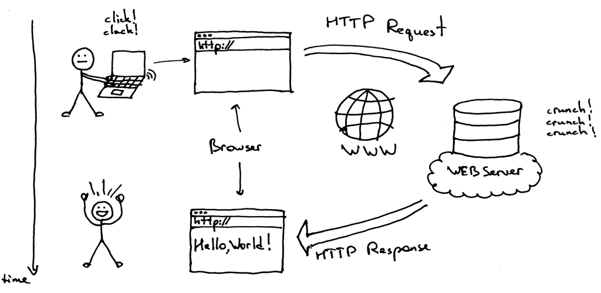

# webserv
## Notions

---
### HTTP Server
A server is a computer program or a device that provides functionality for other programs or devices, called clients.

HTTP server is a server software that implements the request/response model using the World Wide Web and the HTTP protocol.

**The request/response model** : a client sends a request to the server, which performs some action and sends a response 
back to the client, which could be a result or an acknowledgement (like an error message etc.)



**Static vs Dynamic requests** : 
* Static delivery is pre-rendered pages usually stored in a local file system : `http://www.example.com/path/file.html`. 
* Dynamic pages are generated in real-time at the time of the request by the server :
    ```
    GET /path/file.html HTTP/1.1
    Host: www.example.com
    ```

Let's break down a dynamic request :
* `GET` : _method_ request data from a specified **path**. Its best friend `POST` is used to send data to the server.
* `HTTP/1.1` : version
* `Host` : The web server on `www.example.com` will append the given path to the path of its root directory, commonly `/home/www`. 
  * The result is the local file system resource :
    ```
    /home/www/path/file.html
    ```
  * If the file exists, the web server reads it and sends a response to the client’s web browser. 
  The response will describe the content of the file and contain the file itself :
    ```
    HTTP/1.1 200 OK
    ```
  * `Host` is one among many request headers. See the documentation [here](https://developer.mozilla.org/en-US/docs/Web/HTTP/Headers). 

**HTTP response status codes** : Full documentation on mozilla [here](https://developer.mozilla.org/en-US/docs/Web/HTTP/Status). 

---
### Configuration file
A webserver consists of modules which are controlled by **directives** specified in the **configuration file**. 

Directives are divided into simple directives and block directives. 
From what I understood, we must implement [NGINX](https://www.digitalocean.com/community/tutorials/understanding-the-nginx-configuration-file-structure-and-configuration-contexts) directives but I'm not sure. 

Our configuration file must be formatted in the JSON format 
(see [reference](https://developer.mozilla.org/en-US/docs/Web/JavaScript/Reference/Global_Objects/JSON#description)
and [how to parse a JSON file](https://www.json.org/json-en.html)).


