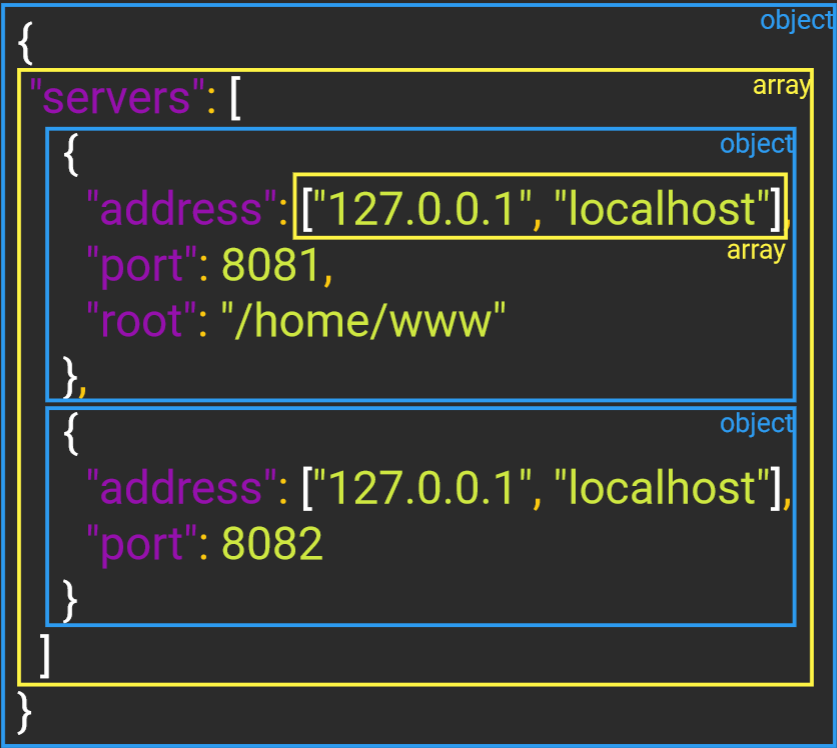

# Config file
The config file will define values for multiple servers.

## JSON structure

Reading the [JSON Standard](https://www.json.org/json-en.html), we see that a JSON file can contain :

### Objects

An object is an **unordered** set of **name/value pairs**. 
An object begins with `{` and ends with `}`. 
Each name is followed by `:` and the name/value pairs are separated by `,`.

### Arrays

An array is an **ordered collection** of values. 
An array begins with `[` and ends with `]`. 
Values are separated by `,`.

### Values

A value can be a string in double quotes, or a number, or true or false, or an object or an array. 
These structures can be nested.