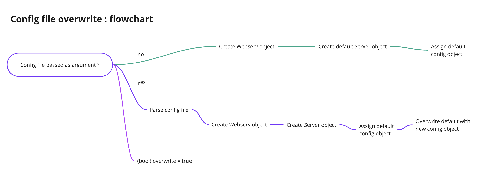

# Config into code

Assigning server options from a config file to the `Server` class.

If a config file is passed as argument, the `Server` will first be assigned with `default.json`, then be overwritten
with the config file.

If not, create one `Server` and assign it with `default.json`.

## Overwriting behavior :
- check if the key exists (server_name for example)
- yes ? replace : skip

## Locations overwriting

- check if the path inside the new location exists
- if no path is given : skip
- if the path doesn't exist : create a new location block
- if the path exist : overwrite the location block

